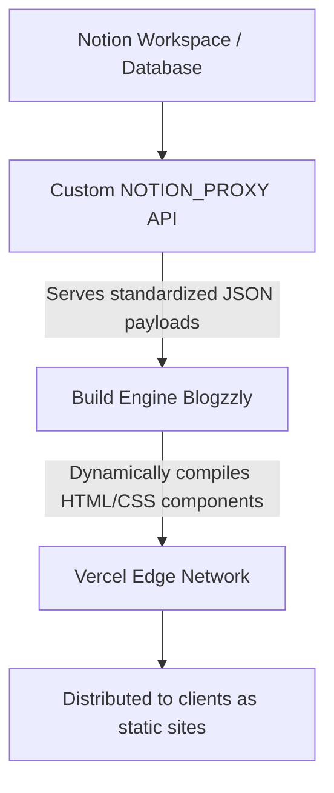

# Blogzzly

> **Project Status: Archived / Sunset**  
> This repository has been officially sunsetted and is preserved here as an archive and portfolio piece. No further active development, security patches, or feature updates will be issued.

Blogzzly is a lightweight, high-performance, minimalist blogging platform designed to fetch content from an integrated **Notion Proxy API** and dynamically render it. Architected with a headless, decoupled execution model, it abstracts content management away from traditional heavy CMS setups, translating rich block data directly into clean, optimized web views.

The platform is fully optimized for serverless deployment on **Vercel**, serving build-time generated static assets at global edge locations.

---

## Features

- **Headless Notion Integration:** Connects via a structured `NOTION_PROXY` service to map Notion database records into native platform routes.
- **Dynamic HTML/Markdown Rendering:** Accepts structured JSON containing frontmatter schemas, asset parameters (S3-secured media handles), and raw source content payloads to render semantic HTML tags instantly.
- **Vercel Optimized:** Built to leverage Vercel's edge network, static site generation (SSG), and image optimization pipelines out of the box.
- **Zero Database Overhead:** No direct application-layer relational or NoSQL database required. Content state lives securely inside Notion.

---

## Tech Stack

Blogzzly uses a lightweight, Python-centric micro-framework architecture designed for efficient data mapping and rapid serverless execution.

| Layer | Technology | Purpose |
|---|---|---|
| **Framework** | [Flask](https://flask.palletsprojects.com/) | Powers the core application routing, request handling, page rendering and emailing. |
| **Language** | [Python](https://www.python.org/) | Handles backend processing, JSON data manipulation, and pipeline mechanics. |
| **Styling** | [Tailwind CSS](https://tailwindcss.com/) | Powers the minimalist typography and responsive layout engine. |
| **Templating** | [Jinja2](https://jinja.palletsprojects.com/) | Dynamically injects parsed HTML text and database frontmatter into responsive views. |
| **Content Source** | [Notion](https://www.notion.so/) | Acts as the headless, block-based workspace backend for content creation. |
| **Hosting & CDN** | [Vercel](https://vercel.com/) | Provisions Python Serverless Functions to host the Flask instance seamlessly on the Edge. |

---

## Architecture & Data Pipeline

Blogzzly operates as an automated compilation pipeline for remote text and media assets.



### Data Pipeline & Hydration
1. **Fetch Layer:** During the static generation build step, the engine contacts your `NOTION_PROXY` endpoint to collect published entries.
2. **Parsing Model:** The build layer reads a structured object schema. Titles, metadata tags, image resource pointers, and post lifecycle flags map directly onto structural components.
3. **Routing:** Static slug paths (e.g., `/posts/why-we-cant-have-nice-things`) are established dynamically at build time, eliminating production-side runtime API delays or dependency on live source connection uptime.

---

## Local Development Setup

Because Blogzzly is structured as a polyglot monorepo, you will run the Node.js data ingestion proxy and the Python Flask web application concurrently in isolated environments.

### Prerequisites
Ensure your machine has the following toolchains installed globally:
- **Node.js** (v18.x or higher) & **npm**
- **Python 3.9+** & **pip**

### Installation & Environment Binding

#### 1. Configure the Data Ingestion Proxy (Node.js)
```bash
cd proxy
npm install
```
- Rename the `.env.example` file inside the `/proxy` directory to `.env` and then update the file with your own values.

---

#### 2. Configure the Web Presentation Server (Flask)
Open a new terminal tab and navigate to the web directory:
```bash
cd web
python -m venv venv

# Activate on macOS/Linux:
source venv/bin/activate
# Activate on Windows:
.\venv\Scripts\activate

pip install -r requirements.txt
```
- Rename the `.env.example ` file inside the `/web` directory to `.env` and then update it with your own values.

---

#### 3. Run the System Locally

To test the end-to-end integration pipeline locally, execute both subsystems simultaneously:

1. **Start the Proxy:** Inside the `/proxy` directory, boot up your Node execution thread:
   ```bash
   npm run dev
   ```
   *(Assumed running default listener profiles on port `8000`)*

2. **Start the Web Engine:** Inside the `/web` directory (with your virtual environment active), boot up Flask:
   ```bash
   npm run dev
   ```
   *(Launches the primary interface route on port `5000`)*

3. **Verify:** Open `http://127.0.0.1:5000` in your browser. The Flask application will query your local Node proxy on port `8000`, process the Notion blocks, and output your static HTML articles seamlessly.

---

#### 4. Email Engine & Template Customization

   Blogzzly features an integrated contact submission workflow powered by **Flask-Mail** and structured using responsive XHTML templates. When a visitor submits the contact form, the backend dynamically processes the payload and delivers a rich-text notification straight to your inbound email address.

   ##### 4a. Mail Engine Architecture
   The email lifecycle maps string inputs from the frontend into localized template variables via the `send_mail()` utility inside `app.py` within the `web` directory.

   ##### 4b. Jinja2 Template Variables Reference
   Your custom XHTML template (`Email-Template.html`) automatically handles the following dynamic backend context bindings. Ensure these configurations match your execution scope:

   | Jinja2 Variable | Source / Core Mapping | Purpose |
   |---|---|---|
   | `{{ host_url }}` | `request.host_url` | Dynamically references your active deployment domain to resolve path hooks for assets like logos and avatars. |
   | `{{ name }}` | `sender_name` (Escaped via `\| e`) | The name value captured from the visitor input field. |
   | `{{ message }}` | `message` (Escaped via `\| e`) | The descriptive body text sent through the form context. |
   | `{{ official_name }}`| Local Function String | The recipient official name rendered in the footer of the email. |
   | `{{ preferred_name }}`| Local Function String | The recipient profile name rendered in the welcome greeting (`Hi {{ preferred_name }}!`). |
   | `{{ your_email }}` | `os.getenv('RECEIVER_MAIL')` | Injects your primary contact anchor address into the author signature panel. |
   | `{{ professional_designation }}`| Local Function String | The recipient's professional designation/title rendered in the signature panel. |
   | `{{ x_handle }}` | Local Function String | Overrides the destination hyperlink for your corporate or personal X (Twitter) profile. |
   | `{{ linkedin_handle }}`| Local Function String | Overrides the destination hyperlink for your public professional LinkedIn workspace. |
   | `{{ copyright_text }}` | Local Function String | Customizes the dynamic copyright text block running along the bottom footer layout. |

   ### Personalization Workflow
   To adapt this engine and template configuration for your own personal distribution or archive mirror, modify the following core locations inside your source tree:

   #### 1. Modifying the Dispatch Identity (`app.py`)
   Open the main server execution routing layer (`app.py`) and locate the initialization variables inside `send_mail()`. Replace the placeholder brackets with your explicit brand properties:
   ```python
   # Configure the visual sender name and structural handle
   sender=('Your Brand Name', os.getenv('HOST_USER'))

   # Set your profile markers and link pathways
   official_name = "Your Full Official Name"
   preferred_name = "Your Name"
   professional_designation = "Your Professional Designation/Title"
   x_handle = "https://x.com/your_username"
   linkedin_handle = "https://www.linkedin.com/in/your_profile"
   copyright_text = "© 2026 Your Identity."
   ```

   #### 2. Updating Assets & Avatars (`/static/images/`)
   The email layout parses image files relative to your root host environment. To customize the branding elements without changing template paths, simply overwrite the default target elements inside your structural image directory:
   * **Brand Logotype Banner:** Replace `/static/images/favicon.png` with your circular brand symbol (Rendered at `200x200px` inside the header row).
   * **Signature Display Portrait:** Replace `/static/images/my-avatar.png` with your headshot or graphic profile mark (Rendered at `150x149px` right next to your signature block).

   #### 3. Content Security Note
   All dynamic text values extracted from client inputs are explicitly piped through Jinja2's native HTML escape sanitization tag (`| e`):
   ```html
   <p style="... ">{{ message | e }}</p>
   ```
   *This ensures cross-site scripting (XSS) inputs or broken symbols wrapped inside form inputs cannot compile raw markup instructions onto your email client parsing environment.*

---

### Data Schema Reference
Incase you decide not to use the proxy included in this repo then you must ensure that the proxy endpoint you decide to use supplies an object response structure matching the specific API signature shown below for hydration to succeed:

```JSON
{
  "success": true,
  "data": {
    "id": "210f81aa-bd3a-80a5-aa92-fcdb7de62154",
    "title": "Why we can’t have nice things",
    "thumbnailImage": "[https://prod-files-secure.s3.us-west-2.amazonaws.com/](https://prod-files-secure.s3.us-west-2.amazonaws.com/)...",
    "description": "Engineered with just the right amount of resilience to survive warranty",
    "author": "Tarv",
    "created": "June 12, 2025 at 7:28 PM",
    "updated": "April 4, 2026 at 9:45 PM",
    "postStatus": "Published",
    "published": "June 20, 2025 at 10:00 AM",
    "slug": "why-we-cant-have-nice-things",
    "tags": [
      {
        "name": "Life",
        "color": "orange"
      }
    ],
    "content": "<p>What if I told you that there is a light bulb...</p><h3>History 🏛️</h3>..."
  }
}
```

### Vercel Deployment Guide

Blogzzly is designed for serverless static site generation (SSG) workflows on **Vercel**. If you wish to spin up a standalone instance or a permanent static archive mirror, execute one of the deployment paths below:

#### Option 1: Vercel CLI (Terminal Workflow)

1. **Install the Vercel execution tool globally:**
   ```bash
   npm i -g vercel
   ```

2. **Initialize the project configuration:** Run the deployment wizard from the root workspace directory and follow the interactive prompts to link your Vercel account:
   ```bash
   vercel
   ```

3. **Assign production environment variables:** Because Vercel's CLI doesn't interactively request custom variables during setup, inject your `NOTION_PROXY_URL` and SMTP variables directly via the CLI tool before publishing:
   ```bash
   vercel env add NOTION_PROXY_URL production
   vercel env add SECRET_KEY production
   ```
   *(Repeat this step for your required `EMAIL_HOST`, `HOST_USER`, `HOST_PASSWORD`, and `RECEIVER_MAIL` tokens).*

4. **Finalize the production build:** Deploy the static build directly to the live edge infrastructure network:
   ```bash
   vercel --prod
   ```

#### Option 2: Vercel Web Dashboard (Git Integration)

1. **Access the console:** Navigate to the [Vercel Web Dashboard](https://vercel.com) and authentic with your GitHub credentials.

2. **Import the repository:** Click **Add New...**, select **Project**, and import your `Tarvone/Blogzzly` repository fork from the repository selection interface.

3. **Configure Build Settings:** Leave the default Framework Preset (or standard generic build commands if applicable), as Vercel automatically maps the distribution directories.

4. **Configure Environment Variables:** Expand the **Environment Variables** panel and add your required key-value pairs:
   - `NOTION_PROXY_URL`
   - `APP_ENV` (Set to `Production`)
   - `SECRET_KEY`
   - Mail parameters (`EMAIL_HOST`, `HOST_USER`, `HOST_PASSWORD`, `RECEIVER_MAIL`)

5. **Deploy:** Click **Deploy**. Vercel will process your build-time optimization hooks, fetch the schema structure from your proxy, and generate a secure, live production URL.

## Project Retrospective

Blogzzly served as a successful proof-of-concept for **decoupled, build-time content delivery**. By shifting the heavy lifting of parsing rich-text blocks and formatting maps from the browser to the build server, the project achieved several key milestones:

*   **Edge-Optimized Performance:** Achieved sub-second "Time to First Byte" (TTFB) by serving immutable HTML chunks directly from Vercel’s global Edge network.
*   **Security & Stability:** By eliminating live database connections at runtime, the application is immune to common server-side vulnerabilities and database downtime.
*   **Editorial Freedom:** Successfully bridged the gap between the flexibility of a rich-text editor (Notion) and the performance of a hand-coded static site.

While this project is now sunsetted, the architecture remains a robust blueprint for developers looking to build low-maintenance, high-speed documentation or personal portfolios.

---

## License

This codebase is open-source software distributed under the **MIT License**. 

You are free to fork this repository, extract the pipeline logic, or adapt the proxy integration for your own projects. For more details, see the [LICENSE](LICENSE) file in the root directory.

---
*Built with ❤️ by Tarvone.*